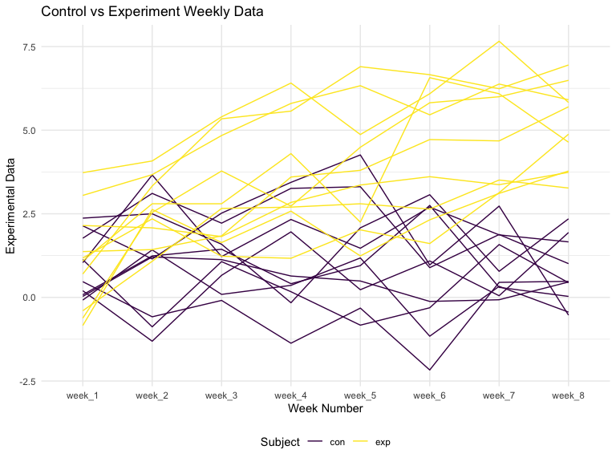
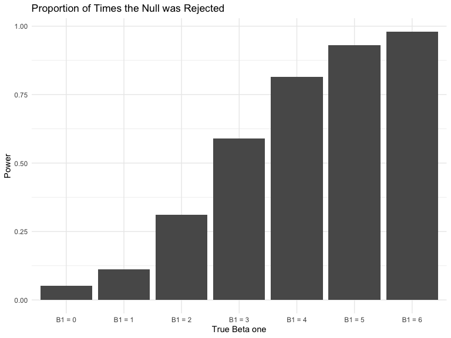
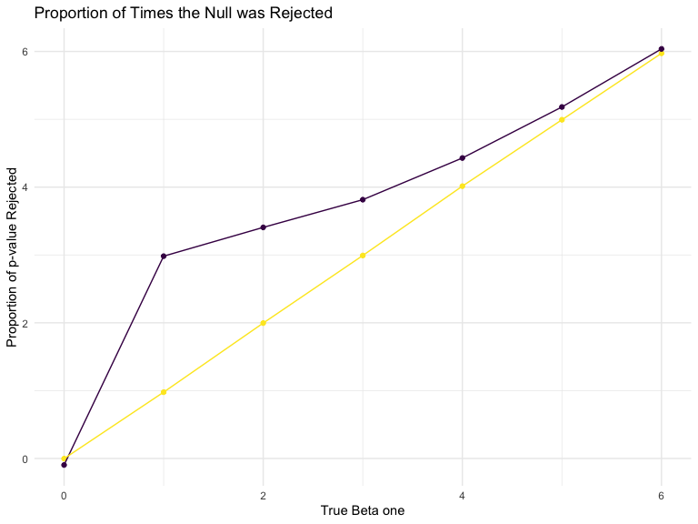

p8105\_hw5\_sl4662
================
Siying Li
11/8/2019

``` r
library(tidyverse)

set.seed(10)

iris_with_missing = iris %>% 
  map_df(~replace(.x, sample(1:150, 20), NA)) %>%
  mutate(Species = as.character(Species))
```

# Problem 1

``` r
iris_with_missing = 
  iris_with_missing %>%
  janitor::clean_names() 

fill_in = function(x) {
  if (!is.numeric(x)) {
    x = replace(x, is.na(x), "virginica")
  }
  
  else if (is.numeric(x)){
    omitted = na.omit(x)
    mean_x = mean(omitted)
    x = round(replace(x, is.na(x), mean_x),2)
  }
}


output = map_df(iris_with_missing, fill_in)

output = map_df(.x = iris_with_missing, ~ fill_in(.x))
```

# Problem 2

``` r
a = as.list(list.files(path = "./data"))

read_data = function(file_name) {
  file_to_read = paste("./data/", file_name, sep="")
  data = read.csv(file = file_to_read)
  data %>% 
    mutate(subject = file_name) %>% 
    select(subject, everything()) %>% 
    mutate(
      subject = str_replace(subject, ".csv", "")
    )
}

output = vector("list", length = 20)

for (i in 1:20) {
  output[[i]] = read_data(a[[i]])
  
}

output = map_df(.x = a, ~ read_data(.x))

study_data = map_df(a, read_data)

study_data =
  pivot_longer(
    study_data, 
    week_1:week_8, 
    names_to = "week_number", 
    values_to = "data"
  ) %>% 
  mutate(id = subject) %>% 
  separate(subject, into = c("case", "subject"), sep="_") %>% 
  select(-subject)


study_data %>%
  ggplot(aes(x = week_number, y = data, color = case)) + 
    geom_line(aes(group = id)) + 
    labs(
    color = "Subject",
    title = "Control vs Experiment Weekly Data",
    x = "Week Number",
    y = "Experimental Data")
```



# Problem 3

``` r
sim_regression = function(n = 30, beta0 = 2, beta1) {
  
  sim_data = tibble(
    x = rnorm(n),
    y = beta0 + beta1 * x + rnorm(n, 0, sqrt(50))
  )
  
  ls_fit = lm(y ~ x, data = sim_data) 
  
  p = broom::tidy(ls_fit) %>% 
    filter(term == "x")
  
  tibble(
    beta1_hat = coef(ls_fit)[2],
    p$p.value
  )
}

sim_results = 
  tibble(beta1_input = c(0,1,2,3,4,5,6)) %>%
  mutate(
    output_list = map(.x = beta1_input, ~rerun(10000, sim_regression(30, 2, .x))),
    output_df = map(output_list, bind_rows)) %>% 
  select(-output_list) %>% 
  unnest(output_df)
  

sim_results %>% 
  mutate(beta1_input = str_c("B1 = ", beta1_input),
         beta1_input = fct_inorder(beta1_input)) %>% 
  filter(`p$p.value`<= 0.05) %>% 
  group_by(beta1_input) %>% 
  summarise(proportion = n()/10000) %>% 
  ggplot(aes(x = beta1_input, y = proportion)) +
  geom_bar(stat = "identity") +
  theme(legend.position = "none") +
  labs(
    title = "Proportion of Times the Null was Rejected",
    x = "True Beta one",
    y = "Proportion of p-value Rejected")
```



``` r
total = 
  sim_results %>% 
  group_by(beta1_input) %>% 
  summarise(mean_beta1_hat = mean(beta1_hat)) %>% 
  mutate(category = "total")

rejected = 
  sim_results %>% 
  filter(`p$p.value` <= 0.05) %>% 
  group_by(beta1_input) %>% 
  summarise(mean_beta1_hat = mean(beta1_hat)) %>% 
  mutate(category = "rejected")
  

rbind(total,rejected) %>% 
ggplot(aes(x = beta1_input, y = mean_beta1_hat, color = category)) +
geom_point(aes(group = category)) +
geom_line(aes(group = category))+
theme(legend.position = "none") +
labs(
  title = "Proportion of Times the Null was Rejected",
  x = "True Beta one",
  y = "Proportion of p-value Rejected")
```


